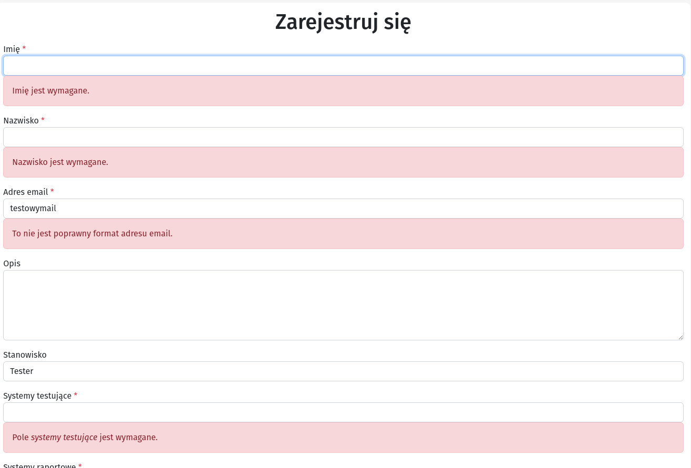
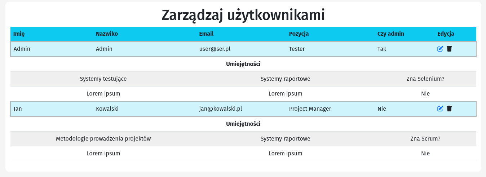
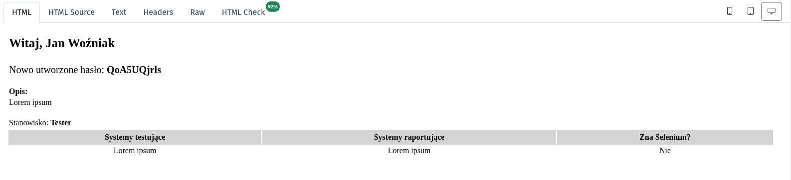

## Opis projektu

Jest to pokazowy projekt, który łączy dosyć proste funkcjonalności, takie jak - rejestracja nowego usera, edycja, usuwanie, wysyłanie maila powitalnego z wygenerowanym hasłem, itp. Wykorzystuję Sanctum (JWT) do komunikacji pomiędzy frontendtem i backendem. Korzystam także z MobX. Jest to drugi projekt w którym korzystam z tej biblioteki. Wcześniej korzystałem z Redux'a, ale wydaje mi się, że MobX jest znacznie przyjemniejszzy w używaniu.
Jest to projekt testowy, więc wiele rzeczy tutaj można zmienić - nawet kilka zaznaczyłem w komentarzach. Tak samo nie pokrywałem całej aplikacji testami, a napisałem jedynie kilka, żeby pokazać, że potrafię to robić.

### Stack technologiczny

- Laravel
- React

## Uruchamianie projektu

W jednym repozytorium umieściłem zarówno backend, jak i frontend.

### Backend

Najpierw należy uruchomić backend. Można to zrobić dosyć prosto za pomocą Composera:

1. **Instalowanie zależności**

```
$ cd ../backend
$ composer install
```

Jeśli używacie, np. wyłącznie Saila, to możecie przekopiować katalog ./vendor z czystej instalacji Laravela. Czystego Laravela można zainstalować, np. w taki sposób:

```
curl -s "https://laravel.build/example-app" | bash
```

Inne metody instalacji znajdują się pod adresem: https://laravel.com/docs/10.x/installation .

2. **Konfigurowanie bazy danych**
   Należy zmienić nazwę pliku .env.example na .env, a następnie skonfigurować połączenie z bazą danych. Nazwa bazy danych może być wymyślona, ponieważ Laravel i tak utworzy nową.

```
$ DB_CONNECTION=mysql
$ DB_HOST=mysql
$ DB_PORT=3306
$ DB_DATABASE=backend
$ DB_USERNAME=sail
$ DB_PASSWORD=password
```

Następnie należy uruchomić Laravela i dopiero wtedy uruchomić migrację.

```
$ ./vendor/bin/sail up
$ ./vendor/bin/sail artisan:migrate
$ ./vendor/bin/sail db:seed
```

Może się jednak zdarzyć, że pojawi się błąd połączenia z bazą danych. Należy wtedy zatrzymać Saila (naciskając ctrl+C) i wpisując w terminalu:

```
$ ./vendor/bin/sail down -v
```

Po czym należy jeszcze raz uruchomić sail up i przeprowadzić powyższe kroki ponownie.

> Pamiętaj, że musisz mieć zainstalowany lokalnie Docker. Jeśli spróbujesz uruchomić projekt przez php artisan serv w domyślnej konfiguracji, to projekt nie będzie działał poprawnie, ponieważ framework zostanie uruchomiony na porcie 8000. W takiej sytuacji trzeba w pliku index.js zmieniać axios.default.baseURL.

### Frontend

Teraz możemy uruchomić frontend

```
$ cd ../frontend
$ npm install
$ npm start
```

Powinna uruchomić się nam przeglądarka z projektem, ewentualnie możemy uruchomić ją sami - **localhost:3000**.

### Logowanie się na stronie

Żeby się zalogować, należy przejść na stronę **/login** i zalogować się danymi domyślnymi

> email: user@user.pl, hasło: password

> Dane logowania są dostępne w seederze

## Testowanie

Testy **nie pokrywają całej aplikacji, zostały stworzone pokazowo**, żeby pokazać, że umiem to robić. Niestety czas nie pozwolił na więcej. Testy można odpalać w następujący sposób.

### Backend

```
$ cd ../backend
$ ./vendor/bin/sail artisan test
```

Przy założeniu, że mamy zainstalowanego Dockera

### Frontend

```
$ cd ../frontend
$ npm test
```

## Funkcjonalności

- **Rejestracja użytkownika** - Przy wejściu na stronę główną zobaczymy formularz rejestracji. Jest on walidowany zarówno po stronie frontendu, jak i backendu. Do obsługi formularzy użyłem react-hook-form. Po wybraniu innego stanowiska jest podmieniany formularz z dodatkowymi umiejętnościami.
  
- **Uprawnienia admina** - na chwilę obecną w projekcie nie można nadawać uprawnień admina, ale domyślnie tworzony user ma przypisaną taką rolę. Można też to zmienić w bazie mysql, zmieniając is_admin na 1. Pojawia się wtedy możliwość przejścia do panelu admina.
  
- **Wysyłanie maili** - Po utworzeniu konta automatycznie wysyłana jest wiadomość z podstawowymi informacjami, oraz hasłem do logowania, które jest generowane automatycznie. Można je zobaczyć w MailHog. Kiedy sail jest uruchomiony. należy wejść pod adres **localhost:8025**, gdzie można zobaczyć maile jakie zostały wysłane. Produkcyjnie trzeba skonfigurować obsługę maili w .env.
  
- **Podstrona /home** - Tę stronę dodałem dodatkowo, ponieważ chciałem, żeby po przekierowaniu, user był automatycznie przenoszony na jakąś stronę, i żeby przy próbubie wejścia zalogowanego usera podadres **/login**, był automatycznie przenoszony na tę stronę. Zostawiłem jednak bez zmian **/register**, ponieważ chciałem, żeby nawet zalogowaniu użytkownicy mogli rejestrować nowych userów.

## Użyte biblioteki

Opisuję tylko frontend, ponieważ po stronie backendu korzystałem praktycznie z czystego Laravela. Doinstalowałem jedynie Sanctum.

- axios
- react-hook-form
- mobX
- react-router-dom
- react-spinners
- helmet

**Pomijam biblioteki instalowane razem z Reactem, jak Jest.**
